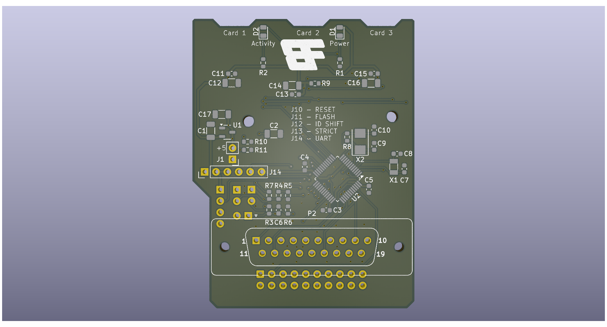

# ACSI2STreMix

This project is based on the ACSI2STM project by Jean-Matthieu
Coulon (retro16). https://github.com/retro16/acsi2stm

## Premise and Changes

The schematics for the project are unchanged from the original
(ignoring the addition of an additional 5V connection).

The changes are primarily to the PCB layout. Bulky components have
been moved to the rear of the board to permit extra clearance 
against the ST case.

Where feasible the board dimensions have been reduced.

All 0402 SMT components have been swapped for 0603 parts to ease
the job of hand soldering. For the same reason the clearance 
between parts has been increased.

The DB19 footprint has been reimplemented to correctly align the
pins and to use individual 1mm diameter board pins (such as these: 
https://www.aliexpress.com/item/4001366384308.html). This requires 
careful alignment of the pins during assembly - I strongly 
recommend using a spare, unpopulated PCB as a jig.

The USB power connection has been moved from the right, to the
left (as viewed from the computer) to bring the connection
closer to the cartridge port for those using a SidecarT.

## Build and Programming

The build of the board should now be easier and there is no 
particular build sequence needed if you are hand soldering
the board. It is probably worth leaving the DB19 pins until
last though to avoid bending them.

The firmware for programming the STM microcontroller should
be taken from the original acsi2stm github repository, no
changes should be required as of version 5.0d (November 2024).
All of the documentation in that repository should be
applicable here too.

## Credits

Thanks to

* Jean-Matthieu for creating the ACSI2STM project
* Glenn (CRG) for prompting this with his video on building the
original retro16 version
* Lee (MFMI) for providing entertainment and support
* The rest of the board folk team for just being brilliant
